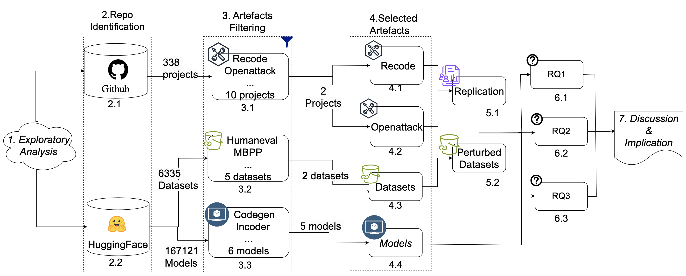

# Log Representation - Supplimental Materials
The repository contains the detailed results and replication package for the paper "Adversarial Attack Classification and Robustness Testing for Code Generation Models".


## Introduction

Our proposed approach of our experiments and our research questions:



We use this repository to answer following research questions:

RQ1: How does altering code at various granularity affect the model’s ability to generate functionally correct code?

RQ2: How do modifications in natural language descriptions at different granularity levels influence the functional accuracy of the code generated
by the model?

RQ3: How does changing comments within the code at various levels impact the accuracy and functionality of the code generated by the model?

## Dependencies
We recommend using an Anaconda environment with Python version 3.10, and following Python requirement should be met, or some models can't be used.

* chardet==4.0.0
* dbus-python==1.2.18
* distro==1.5.0
* fail2ban==1.0.2
* gpg==1.15.1
* idna==2.10
* libcomps==0.1.18
* nftables==0.1
* ntpsec==1.2.2a0
* pexpect==4.9.0
* ptyprocess==0.7.0
* PyGObject==3.40.1
* pykickstart==3.32.10
* pyparsing==2.4.7
* PySocks==1.7.1
* python-dateutil==2.8.1
* PyYAML==5.4.1
* requests==2.25.1
* rpm==4.16.1.3
* selinux==3.5
* sepolicy==3.5
* setools==4.4.3
* six==1.15.0
* systemd-python==234
* urllib3==1.26.5


## Dataset
### Source
We utilize the HumanEval and MBPP datasets in their entirety for our experiments. These datasets are widely used benchmarks for evaluating code generation models. 

### Perturbation Methods

We use the perturbation datasets mentioned in ReCode and perturbation methods mentioned in OpenAttack. And then we reclassify them into three levels(Character-level, word-level, sentence/statement-level). We also classify them into different levels of granularity and research quesions based on perturbation part in datasets.

## Experiments
Given the perturbed datasets, the users can evaluate any of public/customized code generation models with the default inference provided by our benchmark. ReCode also allows users to provide their own datasets and models to evaluate robustness in this benchmark by configuring `config.json` and inference script `evaluate-public-models/run_eval_models.sh`.

After the model evaluation is done on perturbed datasets, ReCode provides overall robustness analysis for the evaluated models such that the users can easily compare across different models and get aware of the possible practical robustness problems.

Lastly, ReCode releases a standard version of the perturbed datasets `dataset-release/perturbed-finalized` for HumanEval and MBPP in this benchmark for general robustness evaluation and compare across different models proposed in future works. We also use Openattack to produce some new datasets, which is saved in `evaluate-public-models/dataset/`.

The general process to replicate our results for evaluating adversarial robustness in code generation models is as follows:

1. Installation: Please run the following commands for installation.
```
conda deactivate; conda env remove --name ReCode
conda create --name ReCode python=3.10
conda activate ReCode
```
Installing huggingface for model inference
```
pip install transformers==4.43.2
pip install -U torch==2.3.1+cu113 -f https://download.pytorch.org/whl/torch_stable.html
```

Installing humaneval. Need to enable humaneval by uncommenting out execution line `exec(check_program, exec_globals)` in `execution.py`.
```
cd evaluate-public-models
pip install -e human-eval
cd ..
```

Installing nlaugmenter for perturbations
```
cd nlaugmenter
pip install -r requirements.txt
pip install https://github.com/explosion/spacy-models/releases/download/en_core_web_sm-3.0.0/en_core_web_sm-3.0.0.tar.gz
cd ..
```

Installing treesitter for perturbations. Note that we customized our code syntax perturbatons based on [natgen](https://github.com/saikat107/NatGen). 
```
cd natgen/treesitter
python build.py # build my-languages.so file
cd ../transformations
ln -s ../treesitter/build/my-languages.so ./
pip install sympy
cd ../..
```
2. Running our ReCode benchmark: ReCode has four main types of perturbations (1) nlaugmenter on docstrings (nlaugmenter) (2) function rename (func_name) (3) code syntax (natgen) (4) code format (format). Multiple variances are defined and implemented for each type of perturbation. One can find detailed config in `config.json`. 

Overall we have multiple steps for benchmark as described in detail in the following sections: (1) [perturb] creating perturbed datasets, (2) [exec] run the models on nominal/perturbed datasets, and (3) [report_coarse] collect and summarize running results according to our proposed robustness metrics. (4) Reclassify these perturbations into three levels(character, word, and sentence/statement levels) and three levels of granularity and research quesions. 
### Step1: Create perturbed datasets [perturb] 

[perturb] option is used to create perturbed datasets. One can run the following commands to perturb based on one's own nominal datasets (path config in `config.json`). 

Note that ReCode released their perturbed data used for evaluation in paper as a general robustness benchmark (`dataset-release/perturbed_finalized`). To directly evaluate on the created benchmark datasets, please change `output_adv_path` in `config.json` to that path and skip all the following commands for perturbing in this [perturb] section!

For Openattack part, please read the `README.md` in OpenAttack.


```
python run_robust.py create_partial natgen # preparing partial code for code perturbations
python run_robust.py perturb nlaugmenter # perturb with nlaugmenter transformations on docstrings
python run_robust.py perturb func_name # perturb with function rename
python run_robust.py perturb natgen # perturb with code syntax transformations
python run_robust.py perturb code # perturb with code format transformations
```

One can specify augmentation method for each type of perturbations with --aug_method, index can be found in `config.json`. --datasets allow to specify perturbed datasets.
```
python run_robust.py perturb func_name --aug_method 0 --datasets humaneval mbpp # perturb with function rename CamelCase (index=0 defined in config.json) on humaneval and mbpp
``` 

### Step2: Run on perturbed datasets [exec] 

[exec] option is used for evaluating targeted models on perturbed datasets. To evaluate models with this benchmark, please config the targeted nominal/perturbed datasets and model path correctly in `config.json`. Then run with:
```
python run_robust.py nominal normal # nominal evaluation with non-perturbed datasets
python run_robust.py nominal natgen # nominal evaluation with non-perturbed partial code datasets
python run_robust.py exec nlaugmenter # nlaugmenter perturbed datasets evaluation
python run_robust.py exec func_name # function rename perturbed datasets evaluation
python run_robust.py exec natgen # code structure perturbed datasets evaluation
python run_robust.py exec format # code format transformation perturbed datasets evaluation
```

If one wants to evaluate specific augmentation method, one can easily run
```
python run_robust.py exec func_name --aug_method 0 # evaluate model on dataset with function rename CamelCase (index=0 defined in config.json)
```

For targeted models please use augments --models and --datasets. Note that one has to correctly config the model names and path correctly in the running shell file in `run_script` in `config.json`. Detailed running hyperparameters can be configured in that shell file. Please make sure that shell file can run correctly for nominal evaluation on your own models/datasets. Our benchmark will mainly call that file for evaluation. The default one is `evaluate-public-models/run_eval_models.sh`
```
python run_robust.py perturb func_name --datasets humaneval mbpp --models codegen-350M-multi codegen-350M-mono # perturb dataset humaneval mbpp on codegen-350M-multi and codegen-350M-mono
python run_robust.py exec func_name --datasets humaneval mbpp --models codegen-350M-multi codegen-350M-mono # evaluate model on dataset humaneval mbpp on codegen-350M-multi and codegen-350M-mono
```

To evaluate perturbed datasets produced by Openattack, please run `evaluate-public-models/run_eval_models0.sh`. Please make sure you have modify the `model_names`, `datasets`, `test_file`, `output_dir` and Experimental setting (e.g. module load python/3.10, source /ReCode/bin/activate) based on your own settings.

### Step3: Summarize running results [report_coarse]

In our paper, we proposed three main robustness metrics: robust pass@k, robust drop@k, and robust relative@k. To summarize and collect the evaluated results, one can run the following commands. `report` option summarizes the detailed robustness results into csv. The results will be saved as tables in `csv`.
```
python run_robust.py report func_name --models codegen-350M-multi codegen-350M-mono --datasets humaneval # get detailed results for dataset perturbed with function rename
```
To get the results from perturbed datasets by Openattack, please run:

```
python run_robust2.py report random --perturbed_result_path "perturbed_dataset_output_dir" --nominal_result_path "nominal_dataset_output_dir"
```

"perturbed_dataset_output_dir" and "nominal_dataset_output_dir" should be modified as your own file path.

3. Reclassify perturbation result into three levels(Character-level, word-level, sentence/statement-level), and also classify them into different levels of granularity and research quesions based on perturbation part in datasets(as tables shown in paper).


## Acknowledgements

Our implimentation bases on or contains many references to following repositories:

* [ReCode](https://github.com/amazon-science/recode)

## Citing & Contacts

Please cite our work if you find it helpful to your research.

Wu, X., Li, H. & Khomh, F. On the effectiveness of log representation for log-based anomaly detection. Empir Software Eng 28, 137 (2023). https://doi.org/10.1007/s10664-023-10364-1

```
@article{article,
year = {2023},
month = {10},
pages = {},
title = {On the effectiveness of log representation for log-based anomaly detection},
volume = {28},
journal = {Empirical Software Engineering},
doi = {10.1007/s10664-023-10364-1}
}
```


